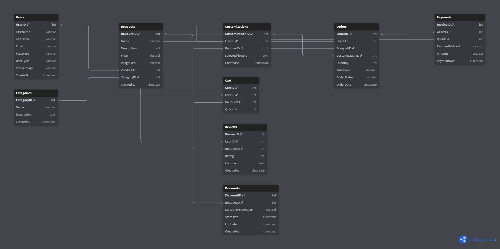

# Capstone Project – Flower Shop Web Application

An online platform for ordering and customizing bouquets from home.

---

## 1. Project Overview and Description

This project is a Flower Shop Web Application designed to allow users to order and customize bouquets online.  
Users can either choose from pre-designed bouquets or create their own arrangements based on their preferences.

**Target Users:**  
Flower shop customers who want to conveniently order flowers online.

**Project Goal:**  
To save users’ time by providing a seamless online ordering experience that can be done from home,  
while also offering customization options for their bouquets.

---

### Competitive Analysis & Value Proposition

While there are several established online flower delivery websites such as 1-800-Flowers, FTD, and ProFlowers,  
this project offers unique value through:

- **Full Bouquet Customization:** Users can design their bouquets by selecting flower types, colors, and arrangements.
- **User-Friendly Experience:** A simple, intuitive interface suitable for all ages.
- **Support for Local Flower Shops:** Helps small or local shops showcase their bouquets online.
- **Personalized Interaction:** Reviews, ratings, and the ability to share bouquet designs.
- **Time-Saving Convenience:** Streamlined ordering, payment, and delivery tracking.

---

## 2. Tech Stack

**Programming Languages & Frameworks:**

- Python
- Django (Backend Framework)
- HTML, CSS (Frontend)

**Database:**

- PostgreSQL

**Tools & Platforms:**

- Git & GitHub (Version Control)
- Visual Studio Code (IDE)

**Additional Packages (Optional / Future Use):**

- Pillow (for image uploads and processing)

---

## 3. ERD / Data Model

The main entities of the application include:  
Users, Bouquets, Orders, Customizations, Reviews, Cart, Payments, Categories, and Discounts.

_(Add your ERD image here if available)_

```md

```
