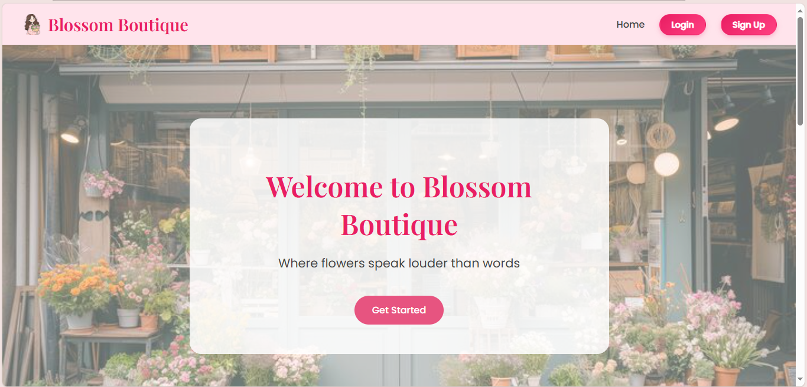
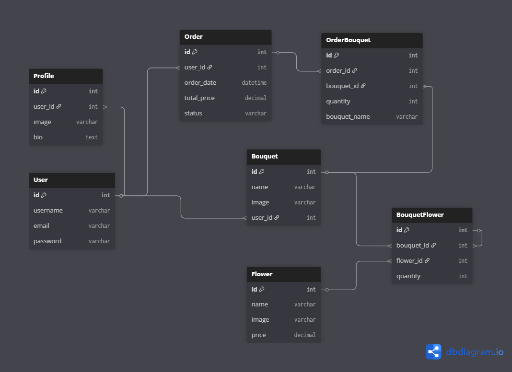

# Capstone Project – Blossom Flower Shop Web Application

An elegant and user-friendly web platform for ordering and customizing flower bouquets online.

---

##  1. Project Overview and Description

**Blossom Flower Shop** is an online flower ordering platform where users can browse, customize, and purchase beautiful bouquets directly from their homes.  
It offers both ready-made designs and full customization options, allowing users to create personalized floral arrangements with ease.

###  Project Goals
- Provide a seamless online experience for ordering flowers.  
- Allow customers to customize bouquets by choosing flower types, colors, and quantities.  
- Enable admins to manage bouquets, orders, and users efficiently.  
- Support local flower shops in bringing their business online.

###  Target Users
- Flower shop customers who want to buy or customize bouquets online.  
- Admins who manage shop operations and bouquet listings.

---

## 💻 2. Tech Stack

| Category | Technologies Used |
|-----------|-------------------|
| **Frontend** | HTML, CSS |
| **Backend** | Python, Django |
| **Database** | PostgreSQL |
| **Version Control** | Git & GitHub |
| **IDE** | Visual Studio Code |
| **Other Tools** | Pillow (for image uploads), Django Admin, Django Templates |

---

##  3. ERD / Data Model

The application consists of several core models to handle bouquets, users, and orders.

### **3.1 MVP Data Model**



**Main Tables:**

- **User** → Stores basic user information such as username, email, and password.  
- **Profile** → Extends the user model with an image and bio for personalization.  
- **Flower** → Represents individual flowers that can be used in bouquets (name, image, price).  
- **Bouquet** → Contains bouquet details created by users (name, image, and creator).  
- **BouquetFlower** → A linking table (many-to-many) connecting bouquets and flowers with a quantity field.  
- **Order** → Records customer orders including total price, date, and current status (`pending`, `confirmed`, `ready`).  
- **OrderBouquet** → Links each order with the bouquets included in it, along with quantity and bouquet name (to preserve data if a bouquet is deleted).

---

##  4. User Stories / Features

### **4.1 MVP Features (Minimum Viable Product)**

####  Customer
- View available bouquets with images and prices.  
- Add bouquets to an order directly.  
- Confirm and place orders online.  
- View order details and track order status (`Pending`, `Ready`, `Confirmed`).  
- View their order history

####  Admin
- Add, edit, and delete bouquets (name, image, and price).  
- Manage orders (update order status: pending → ready → confirmed).  
- View all user orders and bouquet details.  
- Maintain system content and user profiles.  

---

### **4.2 Strategic Features (Future Enhancements)**

####  Customer
- **Create Custom Bouquets:** Choose flowers, colors, and arrangement styles to build a personalized bouquet.  
- **Add Reviews and Ratings:** Leave feedback on purchased bouquets.  
- **Track Delivery in Real Time:** Receive live updates for delivery status.  

####  Admin
- **Manage Users and Vendors:** Add, suspend, or update user profiles.  
- **Revenue & Analytics Dashboard:** Track sales trends, popular bouquets, and income reports.  
- **Approve or Reject Reviews:** Maintain content quality.  
- **Manage Individual Flowers Inventory:** Add or edit flowers for bouquet creation.

---

## ⚙️5. Challenges & Solutions

During the development of the Flower Shop Web Application, several challenges were encountered and successfully addressed:

### 1️⃣ Database Relationships
**Challenge:**  
Establishing the correct relationships between models (User, Bouquet, Flower, and Order) using Django’s ORM was initially complex.  

**Solution:**  
Used `ForeignKey` and `ManyToManyField` with `through` tables (`BouquetFlower` and `OrderBouquet`) to clearly define how bouquets connect to flowers and orders. This ensured accurate data management and flexibility for future customization.

---

### 2️⃣ Image Handling
**Challenge:**  
Handling image uploads for bouquets and profiles while keeping the file names unique.  

**Solution:**  
Integrated **Pillow** for image management and implemented unique filenames using `uuid` or Django’s built-in upload structure to avoid overwriting existing images.

---

### 3️⃣ Dynamic Order Logic
**Challenge:**  
Implementing a logical order flow (Pending → Ready → Confirmed) that works seamlessly between customer and admin views.  

**Solution:**  
Used conditional rendering in templates and clear status management in the `Order` model to ensure smooth updates between states.

---

### 4️⃣ Template & Design Consistency
**Challenge:**  
Maintaining consistent layout and responsive design across all templates.  

**Solution:**  
Created shared base templates and reused common UI components (headers, footers, cards) while adding custom CSS for responsiveness and uniformity.

---

### 5️⃣ Time Management
**Challenge:**  
Building the project within a short timeframe (one week) while balancing design, backend, and documentation.  

**Solution:**  
Followed an MVP-first approach — focusing on core functionality first, then adding polish and enhancements later.


##  6. Installation Guide

Follow these steps to set up and run the project locally:

```bash
# 1️⃣ Clone the repository
git clone https://github.com/sadeenfadel/Capstone-Project-.git
cd Capstone-Project-

# 2️⃣ Install dependencies & create virtual environment automatically
pipenv install django psycopg2 pillow

# 3️⃣ Activate the virtual environment
pipenv shell

# 4️⃣ Apply database migrations
python manage.py makemigrations
python manage.py migrate

# 5️⃣ Create a superuser (for admin access)
python manage.py createsuperuser

# 6️⃣ Start the development server
python manage.py runserver
